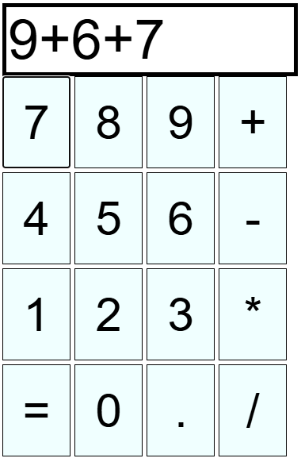
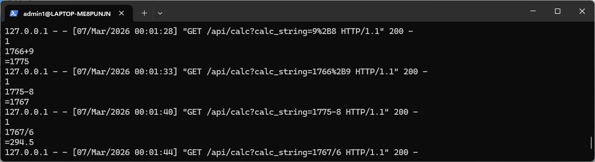

# CalculatorAPI
**Features:**
- HTML web page composes arithmetic expressions
- JS scripts send arithmetic expressions to a local server API using GET requests
- Python back-end server API recieves, evaluates, and returns the result of arithmetic expression to the client
- Client recieves and displays the arithemtic result to the user

 
